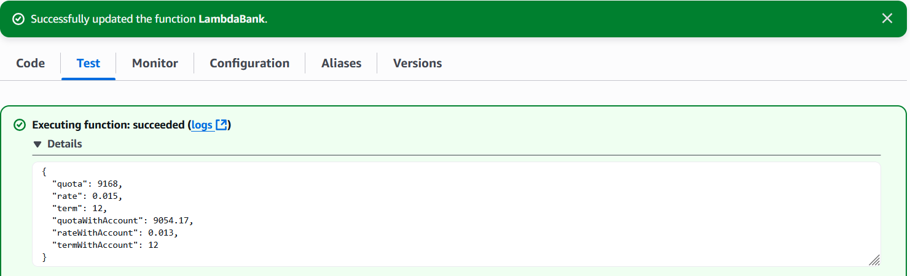

# Java AWS Lambda - Cálculo de cuota mensual bancaria

Este proyecto es un ejercicio práctico que simula el **cálculo de la cuota mensual** de un préstamo bancario, implementado como una función **AWS Lambda** en Java.

---

## Descripción

La Lambda recibe los datos de entrada mediante un objeto `BankRequest` y devuelve una respuesta `BankResponse` con dos escenarios:

1. **Cuota estándar**: basada en la tasa de interés mensual normal.
2. **Cuota con cuenta de ahorro**: se aplica una **reducción de 0.2 puntos porcentuales** en la tasa de interés mensual si el cliente posee una cuenta de ahorro.

---

## Fórmula usada

Se emplea la fórmula financiera para calcular la cuota fija mensual de un préstamo:

`Cuota mensual = (P * i) / (1 - (1 + i) ^ (-n))`

**Donde:**

- `P` = Monto del préstamo
- `i` = Tasa de interés mensual (en decimal, no en porcentaje)
- `n` = Plazo del crédito en meses

---

## Estructura del proyecto

- `LambdaBank.java`: Función principal de Lambda que implementa `RequestHandler` de AWS.
- `BankRequest.java`: Modelo de datos de entrada (monto, tasa, plazo).
- `BankResponse.java`: Modelo de datos de salida con los resultados calculados.

---

## Tecnologías utilizadas

- Java 21
- AWS Lambda Java SDK
- BigDecimal para precisión financiera
- MathContext (`DECIMAL128`) para cálculos exactos
- Maven

---

## Ejemplo de entrada

```json
{
  "amount": 100000,
  "term": 12,
  "rate": 1.5
}
```

##  Resultado de la Lambda



## Créditos

Este proyecto está basado en el ejercicio mostrado en el canal [Un Programador Nace](https://youtube.com/@unprogramadornace).  
Gracias al creador por compartir contenido educativo de calidad.
Todo el crédito por la lógica original pertenece a su autor.